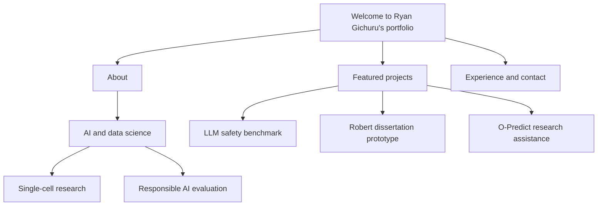

# Welcome to Ryan Gichuru’s Portfolio

This repository contains the source for [ryangichuru.com](https://www.ryangichuru.com): a personal portfolio of AI, data-science, research, and community work.

I’m an Artificial Intelligence and Data Science student at the University of Northampton, due to graduate in 2026 with First-Class Honours. My current interests sit at the intersection of AI evaluation, responsible systems, and AI’s potential to support single-cell research.

## Start here

The raw diagram source is available at [figures/portfolio-overview.mmd](figures/portfolio-overview.mmd).

## Featured work

- **FSD Mental Health Safety Benchmark** — a reproducible evaluation project examining metric invariance, controllability, faithfulness, social pressure, and multi-turn continuity in language models.
- **Robert dissertation project** — a non-clinical, BPD-informed conversational-support research prototype with explicit safety and claims boundaries.
- **O-Predict** — research-assistant work on predictive systems for the Computing Department. Public information is intentionally limited to protect student and university data.

## Repository guide

| Path | Purpose |
| --- | --- |
| [index.html](index.html) | Main portfolio page. |
| [pages/](pages/) | Project pages and long-form project material. |
| [styles.css](styles.css) | Shared site styling. |
| [assets/](assets/) and [Images/](Images/) | Site media and visual assets. |
| [figures/](figures/) | Editable Mermaid diagrams used in documentation. |

## Local preview

This is a static HTML, CSS, and JavaScript site. Open `index.html` in a browser, or serve the repository with any static-file server.

## Contact

- Website: [ryangichuru.com](https://www.ryangichuru.com)
- LinkedIn: [Ryan Gichuru](https://www.linkedin.com/in/ryan-gichuru-1bba671a8/)

Thanks for visiting.
